  

   

  <a href="#sobre"><strong>Sobre</strong></a>
  &nbsp;·&nbsp;
  <a href="#stack"><strong>Stack</strong></a>
  &nbsp;·&nbsp;
  <a href="#projeto"><strong>Projeto</strong></a>
  &nbsp;·&nbsp;
  <a href="#atividade"><strong>Atividade</strong></a>
  &nbsp;·&nbsp;
  <a href="#contato"><strong>Contato</strong></a>

    

  <em>Construindo soluções backend claras, seguras e preparadas para evoluir.</em>

## Sobre

Olá! Eu sou **Isaac Till Borges**, de **Blumenau–SC**. Atualmente, desenvolvo um projeto individual B2B para gerenciamento de pedidos e transformo regras de negócio em uma base backend organizada com **Java**, **Spring Boot** e **PostgreSQL** enquanto curso o **+Devs2Blu**.

<table>
  <tr>
    <td width="50%" valign="top">
      <h3>⚙️ Agora</h3>
      
Evoluindo o <a href="https://github.com/itBorges/gestao-b2b"><strong>gestao-b2b</strong></a>, da fundação técnica às funcionalidades de negócio.

    </td>
    <td width="50%" valign="top">
      <h3>📚 Em evolução</h3>
      
APIs REST, modelagem de domínio, persistência relacional, segurança, validação e observabilidade.

    </td>
  </tr>
</table>

## Stack

  
  
  
  
  
  
  
  

## Projeto

<table>
  <tr>
    <td width="66%" valign="top">
      <h3><a href="https://github.com/itBorges/gestao-b2b">gestao-b2b</a></h3>
      
Plataforma B2B para gerenciamento de pedidos, construída como um backend preparado para crescer junto com as regras do negócio.

      

        <a href="https://github.com/itBorges/gestao-b2b"><strong>Explorar o código →</strong></a>
      

    </td>
    <td width="34%" valign="top">
      <strong>Base técnica</strong>  
      <code>Java 17</code> · <code>Spring Boot</code> 
      <code>PostgreSQL</code> · <code>JPA</code> 
      <code>Flyway</code> · <code>Maven</code>
    </td>
  </tr>
</table>

  
  
  

  
<strong>Ver o que estou praticando neste projeto</strong>

   

  - Estruturação de uma API REST com contexto versionável em `/api`.
  - Modelagem de entidades e persistência com Spring Data JPA.
  - Evolução segura do banco de dados com migrations do Flyway.
  - Preparação para autenticação, autorização e validação de entrada.
  - Observabilidade da aplicação com Spring Boot Actuator.
  - Fluxo de desenvolvimento com branches, pull requests e Conventional Commits.

## Atividade

  
<strong>Ver estatísticas públicas do GitHub</strong>

   

  

    <picture>
      <source
        media="(prefers-color-scheme: dark)"
        srcset="https://github-stats-extended.vercel.app/api?username=itBorges&amp;show_icons=true&amp;hide_border=true&amp;theme=github_dark&amp;locale=pt-br"
      />
      <source
        media="(prefers-color-scheme: light)"
        srcset="https://github-stats-extended.vercel.app/api?username=itBorges&amp;show_icons=true&amp;hide_border=true&amp;theme=default&amp;locale=pt-br"
      />
      
    </picture>
  

## Contato

Encontre-me por aqui:

  
  
  <a href="https://br.linkedin.com/in/isaactborges"
    
  </a>

 

  Blumenau · Santa Catarina · Brasil
   
  Feito com curiosidade, consistência e café ☕

